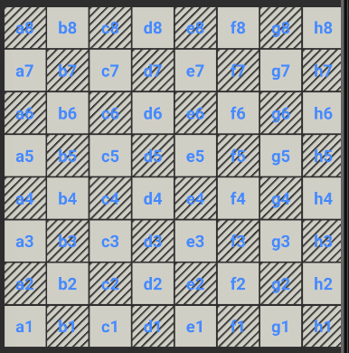

# FlutterTemplate

Basic template for Flutter apps

database password: kood01chessy  
KOOD01: https://github.com/01-edu/public/tree/master/subjects/mobile-dev/chess

### NEEDED CHANGES / BUGS:
  * Need to add one more field to game (GameState - [PLAYING, WAITING, GAMEOVER])

### THOUGHTS:

* There is not much difference when creating and joining game currently, because the logic is the same.
  Join button makes sense only if app shows available rooms to join as list. So join create and join button
  or make list of available rooms?

## TODO <  History Of Development > :

1. Creating game:

- [x] randomize color (set this color in state ??? )
- [x] send gamepieces as map and send color with player uuid
- [x] get created room id to listen to
- [x] setup player board with database map (not init with Gameboard.gamepieces, should come through database)
- [x] Show player that it's currently his turn, after move change turn
- [x] Block player interactions when it's not currently his turn
- [x] show player that 'Waiting for player'

2. Join game: (GameStarter, kicking off)

- [x] find free room and join
- [x] setup gamepieces (again through database)
- [x] Find out what color is available, assign uuid, set his states (myColor)
- [x] playable with other player

INCLUDING:

- [x] When one of players leaves room, notify other player
- [x] When winner assigned, notify both players

NOTE : Before full gamelogic development rethink if things can be simplified, also (DRY & SOLID)

3. Basic GameLogic (starting with only Pawns):

- [ ] Every piece is clickable (last and first column gives error)
- [ ] GameLogic is understandable and flexible ( PiecesMap don't have to be in gameboard, or board holds all pieces?)
- [ ] Pawns are able to take each other
- [ ] Pawns move as expected and based on rules (Last row on gameboard, choose -> Queen,Rook,Knight,Bishop)

### OTHER INFO:

    Table GAMEROOMS
    0 : { 
        white: player_UUID
        black: player_UUID
        db_game_board: Map<String,GamePiece> as String
        current_turn: player_UUID or color 
        game_over: nil (player_UUID if won)
    }

    * GameState needs to hold:
        game_piece_clicked: nil
        game_pieces: Map<String, GamePiece>
        my_color: String
        my_turn: bool
        king_on_check: bool
        message: String

DEPENDENCIES: 
shared_preferences: https://pub.dev/packages/shared_preferences  
flutter_riverpod: https://pub.dev/packages/flutter_riverpod  
supabase_flutter:https://pub.dev/packages/supabase_flutter  

#testing  
mockito: https://pub.dev/packages/mockito   
build_runner: https://pub.dev/packages/build_runner   

#database  
supabase: https://supabase.com/  

